<style type="text/css">
.remark-slide-content {
    font-family: Arial;
    background-color: #f1f1f1;
    #padding: 1em 4em 1em 4em;
}
</style>

```{r setup, include=FALSE}
options(htmltools.dir.version = FALSE)
```

# Abstract

**Note:** This is added to give context for when viewing slides outwith talk

Since the integration of coding skills across the research methods teaching of the School of Psychology and Neuroscience, University of Glasgow, much has been made about the benefits to student development. On the flip side, the benefits to staff have been less documented. One area in which this integration can benefit staff is in enhancing our approach to assignment and feedback practices. Over the past decade we have been working on using code to help build feedback sheets to be more informative and usable by students, be it for data skills, exam essays or critical reviews. Beyond that we have been working on techniques to rapidly extract and summarise the comments given by staff on assignments to allow them to shape their teaching in future iterations of their modules, based on common issues and misunderstandings across student submissions. Key to this approach is seeing feedback to students as a form of data, and through the use of freely available packages in R for working with Microsoft office software I will show some of the techniques we use. Feedback is a crucial part of skill development and with these approaches I hope to show that the process can be both efficient for staff and, ultimately, effective for students.

---
# Goal

- Make assignment feedback more effective for student development
  - where does their grade come from
  - how can they improve in their next assignment
  
- Make the process of assignment feedback more efficient for staff
  - reduce the number of documents people are working with, giving more time to write the actual feedback
  - improve consistency across students
  - allow space for deeper reflection on the feedback, by markers, to help develop future iterations of our teaching.
  
- In short, making the feedback process more efficient for staff will increase the effectiveness for students based on the benefits said efficiency brings.

- **Note:** For simplicity, "feedback" in this talk refers to both feedback and feedforward.

---
class: middle
# Defining Philosophy

Feedback is Data; what you can do with Data you can do with Feedback.
  - the hard part is getting the feedback in a shape to do something with it. 


---
# Motivation

- Rapid development in Feedback of Data Skills teaching

<p style="text-align:center;"></p>

- Feedback for the first lab of Level 2 under the PsyTeachR initiative in 2017 was somewhat limited
  - That said, the task was less structured than future tasks so marking became harder to do on a large scale.

???

No Notes added to this slide but this would be approach.
---
# Motivation

- Rapid development in Feedback of Data Skills teaching

<p style="text-align:center;">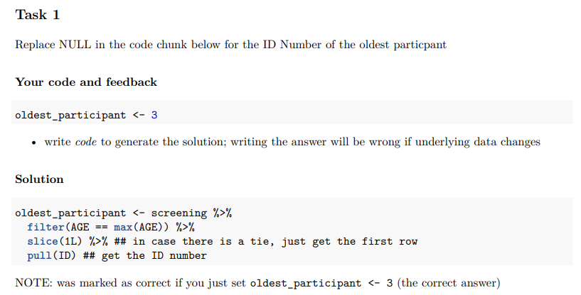</p>

- Second lab of same year introduced much more information for students and included both individual and general feedback
  - Students however felt the long list of tasks in one doc was a bit hard to follow.

---

# Motivation

- Rapid development in Feedback of Data Skills teaching


<p style="text-align:center;">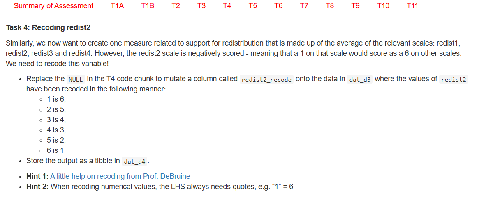</p>

- By Year 2 we have really detailed feedback sheets for Level 2, showing each question in a separate tab.

---

# Motivation

- Rapid development in Feedback of Data Skills teaching

<p style="text-align:center;">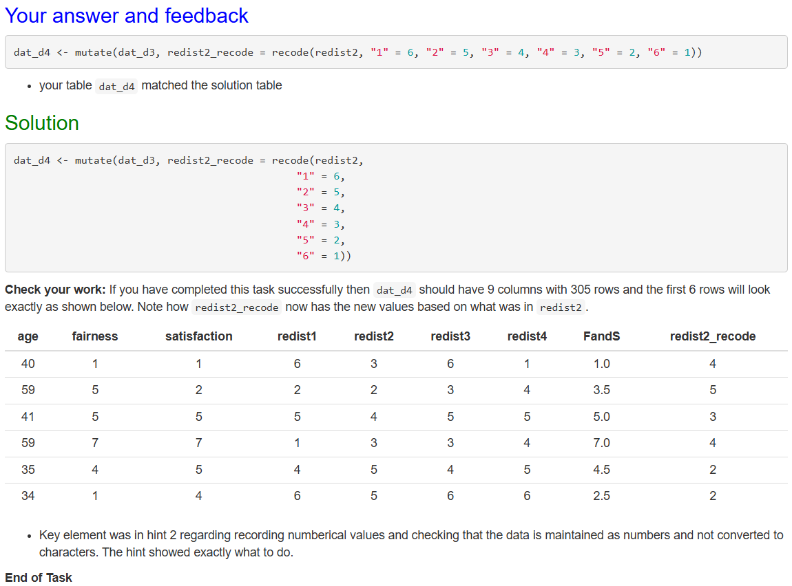</p>

- As well as more detailed general and individual feedback for each student.

---
# AssessR Approach

<p style="text-align:center;">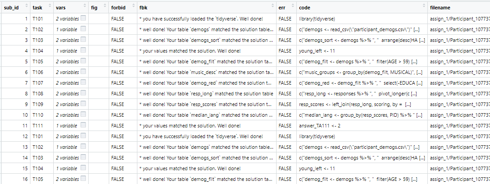</p>

- This works for Data Skills thanks to the [assessr package](https://github.com/dalejbarr/assessr) by [Dale Barr](https://www.gla.ac.uk/schools/psychologyneuroscience/staff/dalebarr/)

  - Each row is single task for a single student and contains their answer and their feedback for that task
  
  - Combining `assessr::feedback_report` (for producing feedback reports) and `purrr::pwalk` (for iteration) you create a feedback file (html, word, pdf, etc) for each individual student from one template `.Rmd` file.

---
# AssessR Approach

.pull-left[
<p style="text-align:center;">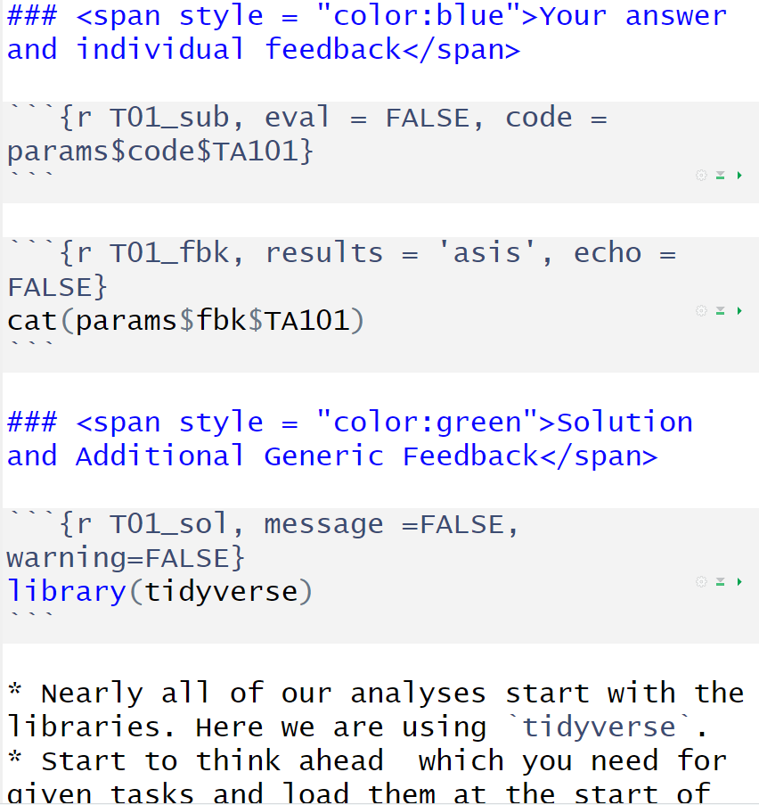</p>
]
.pull-right[
<p style="text-align:center;">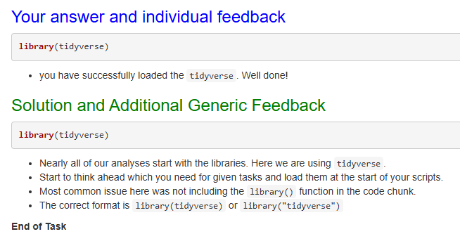</p>
<p style="text-align:center;">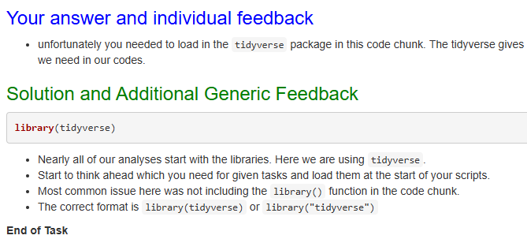</p>
]

- `.Rmd` file (left) is the basis for the individual feedback sheets (right).
- Each student (top and bottom right) gets individual feedback as well as the class generic feedback written after all marking is complete 
  - a more flexible approach leads to a more holistic perspective.
  - both top and bottom grades benefit from the general feedback
  
---
# Issue

- Doesn't work so well for assignments based in Word where the feedback is in separate documents for each student or through on-script comments.

- Common practice is to write one feedback sheet (e.g. a Word docx) for each student, adding: 
  - the marker name, 
  - the student ID, 
  - verbal descriptors (Excellent, Very Good) against the marking criteria, 
  - some open ended comments about improvement 
  - and fill in an excel sheet with the grade
  
- When N is large, the actual process takes time away from generating feedback.
  
# Solution

- Why don't we just get everyone to do their feedback in an excel sheet and generate the feedback from that?

---
# Excel Approach

<p style="text-align:center;">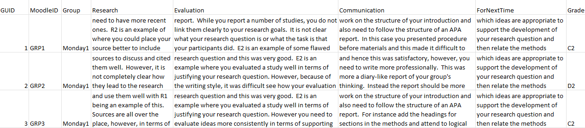</p>

- Same premise as in Data Skills; each row is a student (or group) and each cell relates to a different aspect of the feedback.

- Here each column is one of our marking criteria:
  - Research and Knowledge, 
  - Critical Evaluation, 
  - Academic Communication, 
  - Feedforward
  
- This is the [markr package](https://github.com/psyteachr/markr/) by [Lisa DeBruine](https://www.gla.ac.uk/schools/psychologyneuroscience/staff/lisadebruine/), [Helena Paterson](https://www.gla.ac.uk/schools/psychologyneuroscience/staff/helenapaterson/) and myself
  - **to create individual feedback documents and marking summaries from flexibly organised spreadsheets and other types of input.**
  
---
# Excel Approach

.pull-left[
<p style="text-align:center;">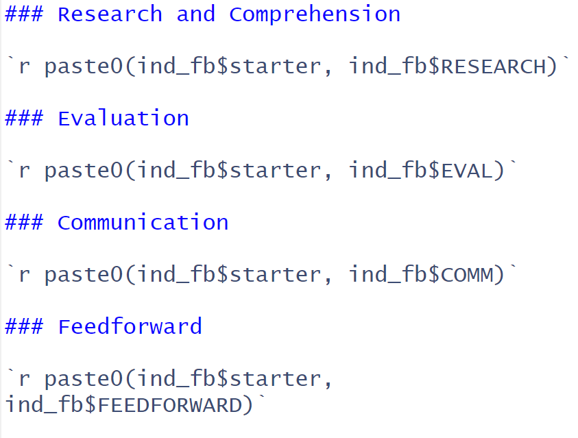</p>
]
.pull-right[
<p style="text-align:center;"></p>
<p style="text-align:center;">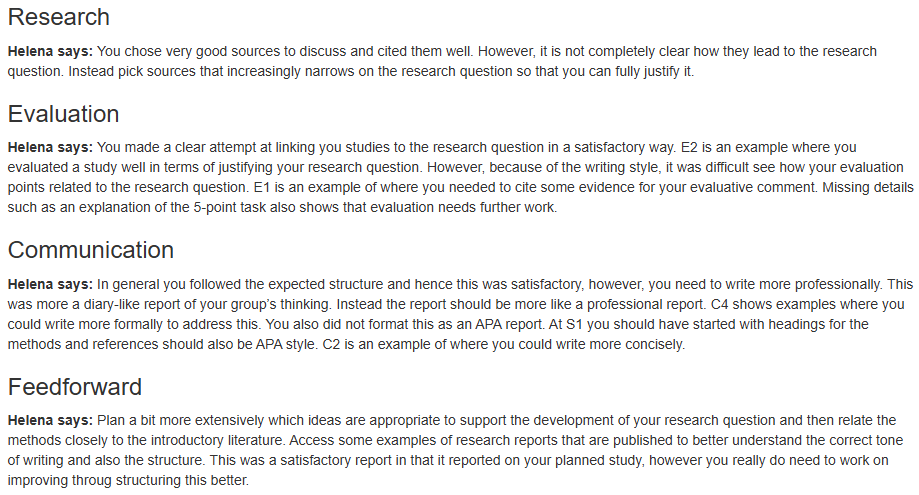</p>
]

- Again,`.Rmd` file (left) is the basis for the individual feedback sheets (right), generated once all the marking is complete
  - Each feedback sheet on the right is an individual student, each receiving feedback specific to their work, generated from the one `.Rmd` template file 

---
# Excel Approach

<p style="text-align:center;"></p>

**Benefits**

- All your feedback is in one place and so: 
  - Marker can have greater reflection as you go along
  - Similar issues can receive similar feedback without backtracking through numerous files
  - Spelling and grammar mistakes in feedback, missed input, etc, can be remedied quickly without finding individual feedback documents
  - Post moderation changes can be actioned relatively easily
  - General whole class feedback can be added to every student's report after marking is complete because the feedback documents don't exist until after marking.
  - Carry out feedback analytics!

---
# Feedback Analytics

<p style="text-align:center;">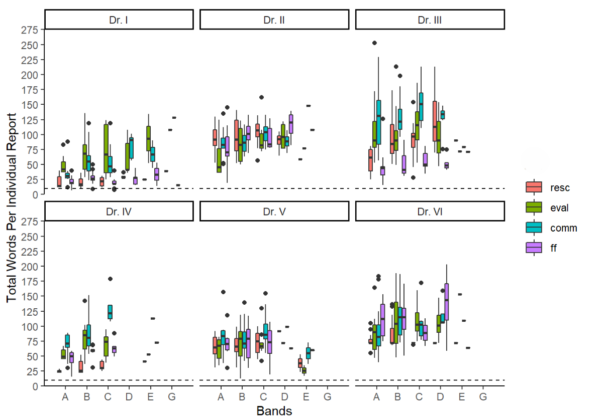</p>

- Along with distributions you can explore aspects such as (shown above) the number of words each marker gives (y-axis) to different marking criteria (colors: research, evaluation, communication, feedforward) and to each grade band (x-axis).
  - dashed line is 10 words; an arbitrary lower bound
  
---
# Feedback Analytics

<p style="text-align:center;"></p>

- For example, a common issue within feedback is A band students receive less feedback than lower bands
  - whilst quantity is not directly correlated with quality, it does give you something to consider and discuss within the marking team.
  
---
# Issue with Excel Approach

- People don't like typing feedback in Excel

  - Excel was never designed to be a word processing tool

--

# Solution

- Use a word processing tool for the feedback and extract the feedback from that.

  - Could use a basic text editor, .Rmd file, .csv file, etc, but again people not really that comfortable with them
  
  - People are really comfortable with Word.
  - **Problem:** How do you extract information from Word documents but still keep the same benefits associated with the Excel approach such as having all the feedback in one place. 

---
# Word Approach

<p style="text-align:center;">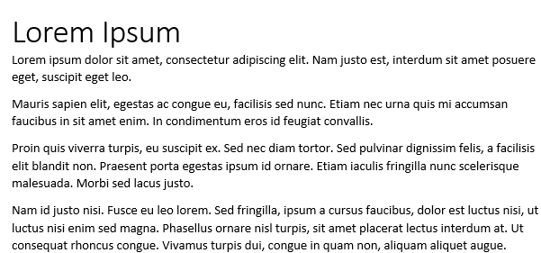</p>

* Here is a basic Word document (.docx) with title, paragraphs, sentences, etc.

---
# Word Approach

```{r, warning=FALSE, message=FALSE}
library(officer)
library(tidyverse)
```

* The [officer package](https://cran.r-project.org/web/packages/officer/index.html) by Gohel, Moog and Heckman

```{r}
doc <- officer::read_docx("TestDoc.docx") #<<
```

- Produces list with various information but fairly unreadable

```{r, echo=FALSE}
doc
```

---
# Word Approach

```{r}
doct <- doc %>% 
  officer::docx_summary(preserve = FALSE) %>% #<<
  as_tibble() 
```

```{r, echo=FALSE}
knitr::kable(doct[1:2,1:6], format = 'html')
```

- `docx_summary()` turns the list into workable dataframe 

---
# Word Approach

```{r}
doct <- doc %>% 
  officer::docx_summary(preserve = FALSE) %>% #<<
  as_tibble() 
```

```{r, echo=FALSE}
knitr::kable(doct[1:2,1:6], format = 'html')
```

- Can start to "ask questions" of the words/data!

```{r, results='asis'}
cat("- **What was the title?**", doct$text[1])
```

---
# Word Approach

- Need some constraints on the structure of the Word doc to make finding relevant information easy.
  - Constraints are anchors you tell the code to search for - if they are consistent then things are easy to find; if not, then they are not!
  - Analogy: searching for parts of the face/voice in face/voice research.

<p style="text-align:center;"></p>

- Marker edits the parts in bold and replaces them with appropriate info
  - Can be pre-populated with Student/Group IDs, Marker name, etc.
  - Can be structured in any way to help give the feedback you want to give.

---
# Word Approach

.pull-left[
<p style="text-align:center;">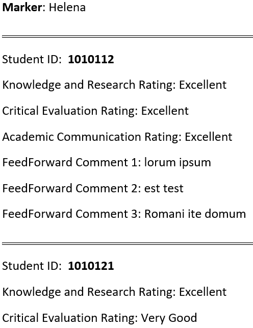</p>
]
.pull-right[
<p style="text-align:center;">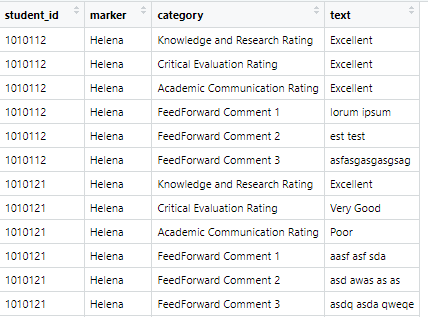</p>
]

- On the left is a completed Marker's feedback and on the right is the data read into a table structure.
- Now we are back to where we need to be to be able to generate feedback sheets and do feedback analytics.
  - e.g. generate all class feedback and check for consistency
- Can produce feedback for individuals, groups, or a mix.
  
---
# Issue

- Feedback sheets can vary across modules

- Some markers want to use code and some don't

# Solution

- Be able to generate any possible feedback sheet and approach people use to give markers the option of approach, even within one module.

- However, making tables in Word from an `.Rmd` file is clunky

- Learn a little about [flextable package](https://cran.r-project.org/web/packages/flextable/index.html) by David Gohel et al.

  - **Note 1:** I once said I would give a presentation on tables and never did. This is not that presentation; this is just a tribute!
  - **Note 2:** Other table packages, e.g. [gt](https://gt.rstudio.com/), exist and may work better depending on what you need.

---
# Flextable

- Designed around producing tables and the one I have found to be best for creating tables in Word that look like someone has used Word to create them
  - i.e. matches formatting of Word
  
- Key is to have a template document where the styles of "body", "Title", "Paragraph", "Heading 1" etc match what you want the output to have.
  - e.g. flextable uses the base Word template (e.g. Times New Roman) unless you give it a new template (e.g. Arial)
  
- Works by building the table you want as a dataframe, including merging cells vertically or horizontally, through the `flextable()` function and calling it with `myft()`
  - easily integrates with [tidyverse](https://www.tidyverse.org/)

- Really good manual: [Using the flextable R package](https://ardata-fr.github.io/flextable-book/) by developers
---
# Flextable

- **The Input**
<p style="text-align:center;">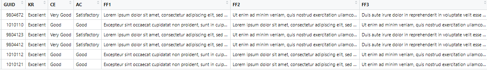</p>

- our now standard dataframe of information
  - worth noting that in this stage of using a dataframe approach you can add any information you want to appear on each student's feedback - even if that information changes per student
  
  - e.g. a link to the marker's "student office hours" time-slot!

---
# Flextable

- **The Output**
<p style="text-align:center;">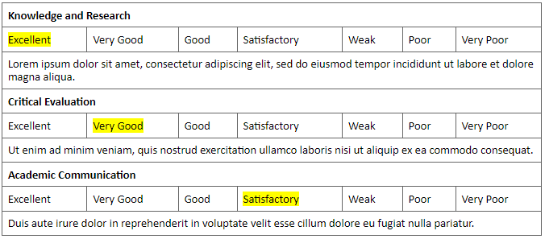</p>

- In this feedback, markers are asked to highlight the verbal descriptor (color, bold, etc) and then add comments into the box below the verbal descriptors for each marking criteria
  - involves continually switching actions on keyboard and mouse, slowing down the process
  - code saves switching between highlighting and typing, as all that information is in the dataframe, and can be coded into the feedback sheet, giving more time for writing and thinking.

---

# Issue

- People really like giving on-script comments!

- **Problem 1:** Research on on-script comments is variable with some suggestion that having no on-script comments is better than negative on-script comments.
  - In addition, too many comments can be seen as nit-picking or just off-putting to students
  - Shameless plug alert: [Paterson & McAleer, (2022). Sharing practice on framing feedback around student development. Open Scholarship of Teaching and Learning. 2, 1 (Oct. 2022), 123–134.](https://osotl.org/index.php/osotl/article/view/42)
  

- **Problem 2:** On-script comments produce high variability in feedback when unconstrained in some fashion.
  - Analysis of ~175 submissions on one module with an individual report submission up to 3000 words
  
---
# Issue

.pull-left[
<p style="text-align:center;">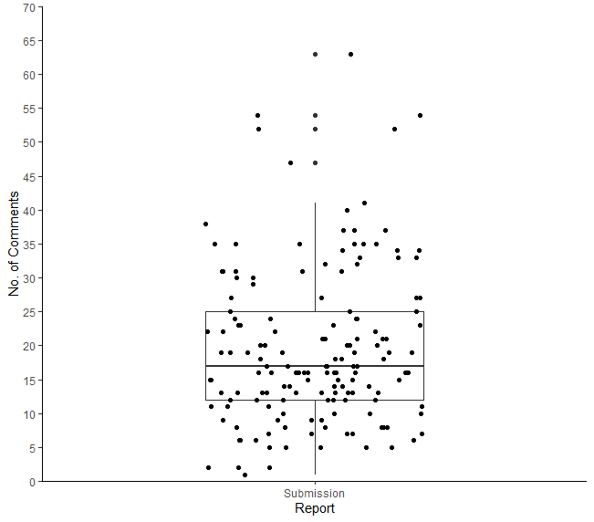</p>
]
.pull-right[
<p style="text-align:center;"></p>
]

- Left figure shows the number of comments per submission; each dot is one submission
- Right figure shows the number of words per comment across all submissions; each dot is the number of words per comment.
  - High variability with how on-script comments are used.

---
# Issue

- **Problem 2:** On-script comments produce high variability in feedback when unconstrained in some fashion.
  - Analysis of ~175 submissions on one module:
  
      - 94% received on-script comments; 6% received no on-script comments (~10 students)
      
      - No. of comments ranged from 1 to 63 per report; an upper bound of 1 comment every 40-45 words. 
      - No. of words per comment ranged from 1 to 143 per comment
      
      - 1 word comment such as "?" is not particularly helpful to students.
      - Correlation between number of comments and grades suggested a weak negative relationship, r = -.234, p = .012
      
      - Parity across students is not maintained and perhaps effectiveness reduces with inefficiency.

---
      
# Solution

- Rapidly extract and check all comments from reports, after giving feedback.

- The [docxtractr package](https://cran.r-project.org/web/packages/docxtractr/index.html) by Bob Rudis (hrbmstr)
  - combine with data wrangling approaches to achieve this goal

--

<p style="text-align:center;">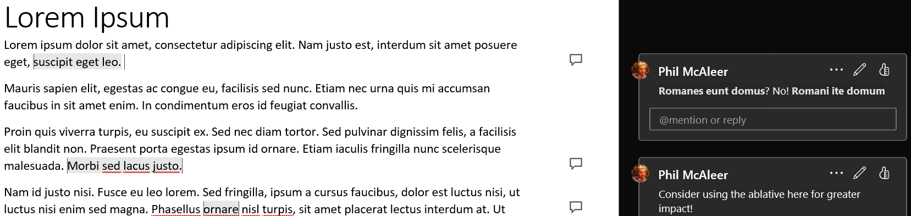</p>

- Word doc with comments

  - Reviewing these manually on one or two documents is not too labor intensive but it quickly escalates as the number of students and/or the number of comments increase, as well as the position of the comments varying.

---
# Comment Extraction from Word

```{r, warning=FALSE, message=FALSE}
library(docxtractr)
library(tidyverse)
```

```{r}
doc <- docxtractr::read_docx("TestDoc.docx") #<<
```

```{r, echo=FALSE}
doc
```

- Shows the number of comments within each document. 

---
# Comment Extraction from Word

```{r}
doc <- docxtractr::read_docx("TestDoc.docx") %>%
  docx_extract_all_cmnts() %>% #<<
  as_tibble()
```

```{r, echo=FALSE}
doc
```

- `docx_extract_all_cmnts()` allows you to pull all of the comments from the document for comparison and analysis.

  - e.g. whether comments will actually mean anything to a reader or not
  
  - e.g. whether you have left something in by mistake

- Could check all comments manually if you have time to develop further feedback or use some level of AI to assist.

---
# Comment Extraction from Word

```{r, eval = FALSE}
doc <- docxtractr::read_docx("TestDoc.docx") %>%
  docx_extract_all_cmnts() %>% #<<
  as_tibble()
```

```{r, echo=FALSE}
doc
```


```{r, eval=FALSE}
cat(doc$comment_text[1])
```

- A scan of the comments helps determine how informative they are!

```{r, echo=FALSE}
cat(doc$comment_text[1])
cat(doc$comment_text[2])
cat(doc$comment_text[3])
```

---
# Additional work

- The codes can work forward and backwards
  - If you have old feedback sheets, it is possible to extract the information from those
  - I use this process to check feedback sheets before they go to students to try to reduce issues such as missing names, typos, etc.
  - Incredibly useful to see common mistakes from previous years to help develop future iterations our teaching
  - If you are writing the same comment each year, you maybe need to change some part of the teaching.


- The codes can work without anchors in the text but it is harder
  - People tend to take quite different approaches to the same task, no matter how clear you think your instructions are.
  - "Generative AI Declaration" in Appendix A had about 10 different approaches in 35 submissions
  - Not impossible but the extraction code will only get you so far and the rest becomes about wrangling
  - If possible, set some restrictions/guidance on the location of the information you want to extract

---
# Conclusions

- Feedback is Data for both staff and students
  - It helps students develop their knowledge and skills, and it helps staff develop their teaching
  
- Having all feedback in one location can be really effective for staff efficiency
  - It reduces the number of documents being dealt with, improves parity in feedback across submissions, and allows greater reflection in terms of what students are and are not understanding
  
- Coding allows a flexible approach to feedback and feedforward generation
  - Instead of our approach being dictated by the feedback sheet, the feedback sheet becomes dictated by our approach to feedback

---
class: middle
# Acknowledgements

- Lisa DeBruine for help with looping and iteration (my nemesis) and for markR

- Dale Barr for help with data skills assessments and assessR

- Helena Paterson for continual numerous discussions on "feedback as data" and for being a pedagogical superstaR

---
# Here to help!

- Happy to share working versions of all codes mentioned, including the functions that allow the iteration across students. 
  - They will one day be on an open source repository but still got a few bits to tidy up.
  
- If you would like to use this approach or something based around this approach, please just ask.
  - more than happy to support you generate the most effective feedback for your students in the most efficient way for you.

- Slides will be available from github soon but please just ask if you want a copy

---
class: middle
# Defining Philosophy

Feedback is Data; what you can do with Data you can do with Feedback.
- It is no longer that hard to collate feedback and treat it as data!
---
class: middle
# Contact

**email:** [philip.mcaleer@glasgow.ac.uk](mailto:philip.mcaleer@glasgow.ac.uk)

**linkedin:** [linkedin.com/in/phil-mcaleer](linkedin.com/in/phil-mcaleer)

**github:** [https://github.com/philmcaleer](https://github.com/philmcaleer)

**web:** [https://www.gla.ac.uk/schools/psychologyneuroscience/staff/philipmcaleer/](https://www.gla.ac.uk/schools/psychologyneuroscience/staff/philipmcaleer/)